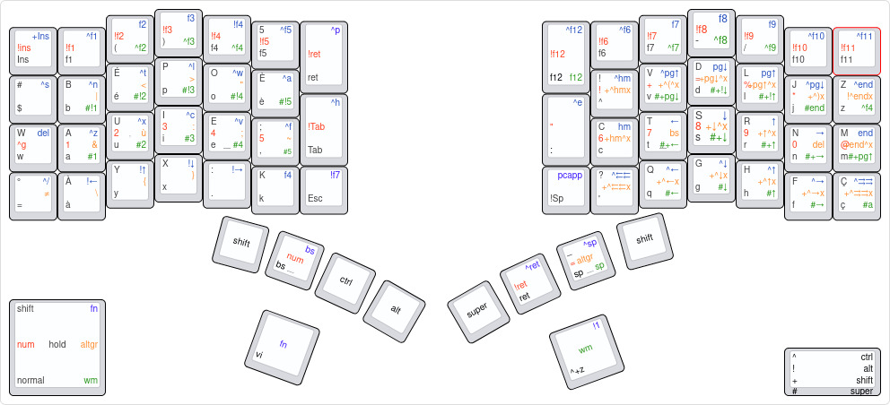

# My personal layout

See on http://www.keyboard-layout-editor.com/#/gists/831524ae41aec20a65ff519557db7f50

# My Layers
There are 5 layers (primary, fn, cut, numpad, altgr)

## Primary layer (activated by default)

### Classical keys

I used bépo layout (equivalent of dvorak for french) but tiny changes because missing keys of the left upper side of the keyboardio model 01. 
* w is on the first key on the left of the homerow left. 
* = is on the first key on the left of the row below the homerow left.
* $ is on the first key on the left of the row above the homerow left.

### Special keys
* Led is mapped to Enter (needed sometimes with left hand).
* Menu is mapped to launch my windows selector (launch rofi under linux with only my windows, switcheroo on windows).
* Return is mapped to :
* Any is not yet mapped (to define)
* Prog is mapped to Ins

### Palm keys
* Right Palm keys (fn1) is mapped Shift+Super+Z to launch my launcher (launch rofi under linux and executor.dk on windows).
* Left Palm keys (fn2) is mapped to activate Leader key on my Vi mode.

### Left side
Shift, Backspace, Ctrl, Alt.

#### Shift
Shift on the left of backspace and the right of to be better accessible than the original place.

I prefer to let 2 keys because : 
* We need to let on the 2 sides because some shortcuts are like Ctrl+Shift notably in Intellij.
* Alternate the shift use (use left shift to capitalize right letters keys and use right shift to capitalize right letters keys).

It is use with OneShot plugin (no need to press simultaneously modifier + key, you can do modifier then key)

#### Ctrl / Alt
Let only Ctrl and Alt on the left with OneShot plugin (no need to press simultaneously modifier + key, you can do modifier then key) to have more notably return.

I have quasi no shortcut with Ctrl+Alt+something or have an alternative to use this shortcut.

Alt on the left to be able to do the Alt+Tab only with the left hand.

### Right side
Super, Return, Space, Shift.

Return on the left of Space to be better accessible than the default place.

The space is a macro, if Shift is press, the space is mapped to _ (useful when you type some constants in Java/Kotlin).

Super on the left of Return.

## Fn Layer (activated by holding the left palm key)

### Left side keys
All the common shortcuts available in File / Edit menu are available, can be used with the mouse on the right side if needed.
* On the row below the homerow left, you have global shortcuts the file menu shortcuts (Ctrl+S, Ctrl+N, Ctrl+T, Ctrl+F3, Ctrl+W, Alt+F4, Ctrl+A)
* On the homerow left, you have global shortcuts the file menu shortcuts (delete, Ctrl+Z, Ctrl+X, Ctrl+C, Ctrl+V, Ctrl+F, Ctrl+H)
* On the row below the homerow left, you have shorcuts for navigate between files mainly in Intellij with some customizations : Ctrl+/ (comment), Alt+Left (previous file), Alt+Down, Alt+Up (go to parent directory), Alt+Right (next file), F4 (go to declaraton), Alt+F7 (find usages)
 
### Right side keys
All the shortcuts to navigate really quickly in a editor.
* On the homerow right, you have home, left, down, up, right, end (as vi k,j,l but shift on the right to have it on the real homerow keys), clearly better than a inverse T when you are used to.
* On the row below the homerow right, you have the same but with Ctrl+ (except where home / end replace by Ctrl+Left/Right*4)
* On the row above the homerow right, you have Ctrl+Home (start of a file), Ctrl+\( (code block start), PgDown, PgUp, Ctrl+](code block start), Ctrl+End (end of a file). 

### Palm Keys
* Right Palm key is mapped to Alt+1 to go quick to project dock in Intellij and back to the main editor dock through Esc.

### Cut Layer (activated by holding the right palm key)

### Left side keys
All the shortcuts are used to manipulate windows (on linux, I used openbox with on linux see my dotfiles https://github.com/alexandrenavarro/dotfiles/blob/master/.config/openbox/rc.xml, on windows I used some scripts in AutoHotKeys see https://github.com/alexandrenavarro/wiki/blob/master/windows-10/Configuration.md):
* On the homerow right, you have : move to 1/4 left windows, move to 1/2 left windows, minimize, maximize, move to 1/2 right windows, move to 1/4 right window.
* On the row below the homerow right, you have more moves, to detail (see layout).
* On the row above the homerow right, you have more moves, to detail (see layout).

### Right side keys
All the shortcuts to cut/delete really quickly in a editor or a terminal (customize your terminal shortcuts). There are totally equivalent of Fn layer
* On the homerow right, you have cut/delete to : home, left, down, up, right, end.
* On the row below the homerow right, you have the same to cut/delete but with Ctrl+ (except where home / end replace by Ctrl+Left/Right*4)
* On the row above the homerow right, you have to cut/delete Ctrl+Home (start of a file), Ctrl+\( (code block start), PgDown, PgUp, Ctrl+](code block start), Ctrl+End (end of a file). 

## Altgr Layer (activated by Holding Space)
It is the equivalent of altgr (right alt) for bépo but with some customization (easy to do customization like that).
* < and > are accessible directly instead « of »
* : ¨ was inverse.

## Numpad Layer  
All digits are set on the homerow (some x position as there are on the top row).

On first key on homerow left is mapped to Ctrl+G (go to line), generally use before typing number.

The key at the right of 0 is mapped to point.

## Vi Mode
Tap first fn1, then tap the number (like numpad + digit but without numpad hold but it is optional, by default it is 1), then tap the movement on the right side (like fn + right keys but without fn).
It will select the text from the current position of cursor to the movement you asked. 
You have just to choose the operator you want to apply (delete with Delete key, cut with Ctrl+X, copy with Ctrl+V, unselect with Right).
In vi you do number + command + movement, here you do number + movement, it will select the text and do the operator you want.

# Pros and Cons of my layout : 

## Pros :

### Fn Layers
* All common shortcuts are accessible through fn left keys, notably edit shortcuts Delete/Undo/Cut/Copy/Paste/Search/Replace on the left homerow (really useful and accessible).
* You can quickly edit a file with a classical file editor with fn right keys, notable Home/Left/Down/Up/Right/End on the right home (really useful and accessible)
* You can easily navigate between your file in your favorite IDE through fn and left keys.
* All common actions you use with your mouse are accessible with only the left hand.

### Cut Layer
* Move, Maximize, Minimize your different windows are easily accessible and customizable on the left side.
* Delete/Cut a letter / word / line are really easy, useful also in a terminal (don't forget to customize your shortcuts of your terminal). 

### Numpad layer 
* Numbre are really accessible through Backspace + homerow keys.

### Altgr layer 
* Altgr keys are really accessible through Space + left keys with some potential customizations.

### Thumb keys
* Shift / Return are more accessible.

### Plugin OneShot
* You can type easier / quicker your modifier then your key.

### Plugin Qukeys
* You can have more layer with this plugin (the meanings of a key is different if it is tapped or hold).

### Plugin Leader
* You can have a kind vi mode like with leader plugin.

## Cons 
* Can't let backspace or space pushed to type multiple times, you have to use fn+backspace or cut+left to do it or fn2+space, but prefered because of the need to have quick access to numpad, altgr layer and _.
* Alt + Tab is not accessible as I want (nevertheless accessible only with left hand, better than a classical placement) but I don't find better solution or a way to it.
* Need to unpress backspace (or use cut + left) to fix an error when you type number.
* Windows manipulations are not accessible with only the left hand.
* Find no real solution for the pointer through a plugin keyboard (the official mouse plugin is not really useable for real life) or the add trackpoint/trackpad on the keyboard.

# Some feedbacks on ideas I tested but it was not sucessful

## Use Qukeys on homerow keys 
I tried to used Qukeys like ctrl+alt+super+shift on the 2 homerows, it was easy to learn but there is one main drawback.

You see the letter of the keys of the homerow appears when you untapped, not when you tapped the letter (like with a delay betwen 10-100 ms depending of your speed), and personnaly I never got used to.

I used QuKeys only on backspace / spacebar because I can't really notice this problem on these special keys.
 
## Use a macro to type several letters
I tried some stuffs like ". ", ", " or ". "+Shift letter but at the end, I did not use it.

## Use fn when typing a word
When you hold the fn, you change the position of your hands which is not really problematic when type on key on the same hand or multiple on the other hand but not really easy when you type some keys on the same hand.
So use fn for shortcuts one time or move your cursor.  
 
## Having a numpad only on a side
I tried to have numpad just on the right side, first like classical numpad 

     789
     456
    0123

or

    56789
    01234

but it is not a good idea.

I didn't realize at first, I never got used to, I think the problem is you can't type quickly number because you use only your right hand.

## Create a vi like mode with Leader plugin 
I started to used Leader plugin to develop something like you can do in vi, 5dd (delete next 5 lines).

I did some stuffs like leader key + number (equivalent of num + homerow) + movement (equivalent fn on right side), it will select the text and after use the command like Ctrl+C you want but I don't really use it finally.

I'm interested if some vi gurus what kind of command they often use they can't do it with my layout.

## Some observations I didn't expect when I customize my layout
* I used really few Ctrl+S (my IDE for programming in Intellij which save automatically), Ctrl+O, Ctrl+N.
* I don't used anymore Super key.
* I used more Ctrl+F I expected.
* With this layout I used quasi never Ctrl or Alt directly, except Alt+Tab and some IDE shortcuts (Alt+f12 or Ctrl+Shift+F10 mainly).
* Use palm key + something for one action (because it is really quick to tap) but not something in your flow of typing like an altgr (because the position of your hands are not well positioned).
* You can customize shortcuts in a terminal in order not to have emacs, but depending of your terminals, the ways how the characters are typed are really different, use `showkey -a` to understand how you terminal understand what you type, it can be really different between the terminals. 
* Don't map Left Palm Key (fn1) with a launcher or something similar because you will use a lot and sometimes for editing and sometime you will tap it by accident (you tapped and untapped quickly because you changed what you want to do). Personnaly, it is mapped to Vi mode and works well in real life.
* Don't try optimize everything, focus on the one the need to keep your "flow" like when you are programming or stuffs you do regularly and you want to be productive as possible. 
Example : Don't care the shortcuts when you navigate on an browser because generally, you are not in your flow but you are just searching / reading something. 

## Some others ideos not tested
* Having a layout for tmux, I'm not a heavy user of tmux but clearly, if your are, create a layout for that makes sense and easy to do. 
  
# Conclusion
I really think customizing my layout help me to be more productive on the different common tasks notably when I'm programming (reading or writing code).
I wrote this because I want to share my feedbacks and I hope some of my ideas can be useful for some other people.
I made a long time ago a quicky in french in a conference on keyboards (https://www.youtube.com/watch?v=FbU7AAPbTIM), it is not up-to-date on my last modifications of my layout but you may learn some stuffs.
Don't hesitate to contact me if you have some questions or feedbacks.
